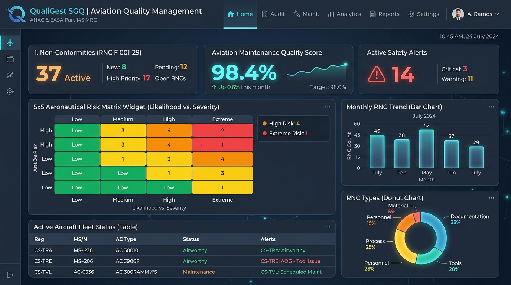
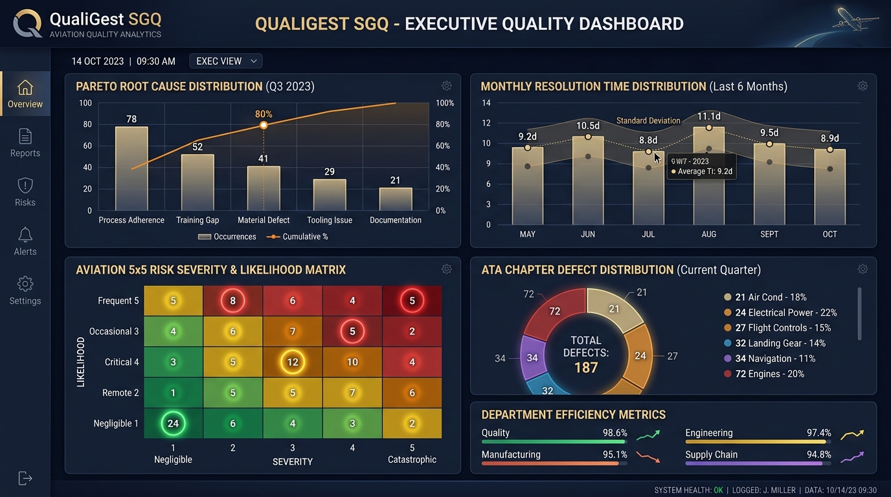
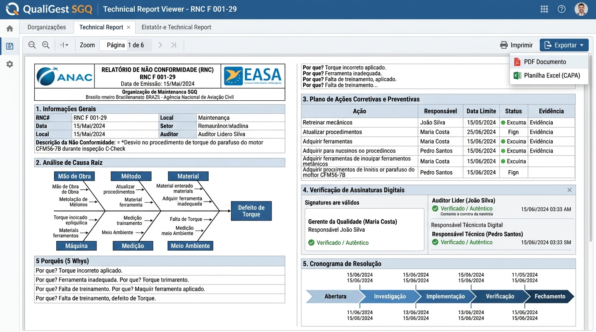
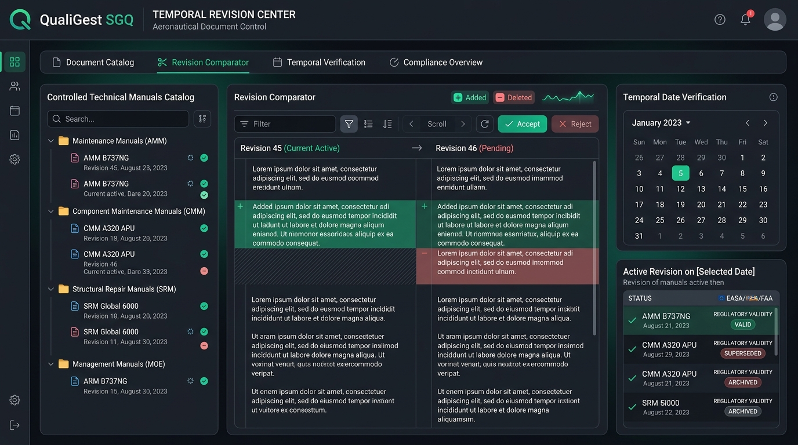
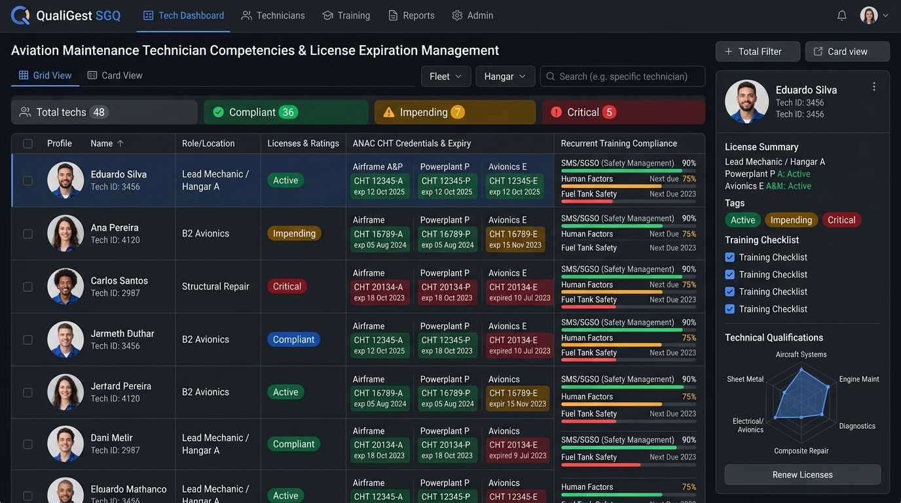

# QualiGest SGQ — Sistema Integrado de Gestão e Garantia da Qualidade Aeronáutica

<div align="center">

[](https://impacto.aero)
[](https://impacto.aero)
[](https://impacto.aero)
[](https://impacto.aero)

**A Plataforma Enterprise de Garantia da Qualidade, Segurança Operacional e Compliance para Oficinas de Manutenção Aeronáutica (MRO), Centros de Serviços e Operadores Aéreos.**

[Visão Geral](#-visão-geral) • [Diferenciais de Negócio](#-diferenciais-estratégicos--roi) • [Telas e Módulos](#-demonstração-visual-do-sistema) • [Relatórios Oficiais](#-relatórios-técnicos--dossiê-f-001-29) • [Arquitetura](#-arquitetura-e-segurança) • [Instalação](#-instalação-e-execução)

---

</div>

<p align="center">
  
</p>

---

## 📋 Visão Geral

O **QualiGest SGQ** foi concebido especificamente para atender aos rigores operacionais e normativos de centros de manutenção aeronáutica homologados segundo **ANAC RBAC 145**, **EASA Part-145**, **FAA Part 145**, **ISO 9001** e **AS9100**.

Mais do que um simples emissor de Não Conformidades, o QualiGest é um **ecossistema integrado de governança da qualidade e conhecimento técnico**, interligando:
- **Gestão de RNCs (F 001-29)** com Matriz de Risco Aeronáutico 5x5 e planos CAPA;
- **Auditorias Externas** de autoridades reguladoras e clientes com geração de lições aprendidas;
- **Dossiê de Pessoas e Habilitações Técnicas (CHTs ANAC)** com controle preditivo de vencimentos;
- **Controle Documental com Consulta Temporal**, garantindo que qualquer intervenção técnica do passado possa ser auditada com a revisão exata que estava em vigor no dia do evento;
- **Copilot de IA Aeronáutico (Gemini)** treinado para sugerir causas raízes, auditar coerência técnica e acelerar investigações.

---

## 💎 Diferenciais Estratégicos & ROI

| Pilar | Desafio Tradicional no MRO | Solução QualiGest SGQ | Impacto no Negócio |
| :--- | :--- | :--- | :--- |
| **Tratamento de RNCs** | Planilhas descentralizadas, prazos perdidos e análises de causa superficiais. | Workflow guiado (5 Porquês + Ishikawa 6M), cálculo automático de criticidade e alertas por e-mail. | **-85% no tempo de ciclo** de fechamento de RNCs. |
| **Auditorias ANAC/EASA** | Semanas organizando pastas físicas, dossiês e evidências para auditores. | Central de Auditorias com exportação instantânea do acervo de evidências e RNCs correlatas. | **Auditorias sem surpresas** e risco zero de multas por descontrole. |
| **Vencimento de CHTs** | Técnicos liberando aeronaves com treinamentos ou CHTs vencidos (falha grave). | Central de Vencimentos Preditiva (alertas aos 60, 30 e 15 dias) e Matriz de Competências por posto. | **100% de compliance** com as exigências do RBAC 145.163. |
| **Acervo Documental** | Risco de uso de revisões obsoletas de manuais de manutenção (AMM/CMM). | Consulta Temporal com precisão de data, logs de leitura obrigatória e comparador visual de revisões. | **Blindagem jurídica e técnica** contra apontamentos de auditoria. |
| **Multi-Tenancy** | Dificuldade em gerir filiais, bases operacionais ou clientes segregados. | Isolamento rigoroso por organização no Firestore (`/organizations/{orgId}/...`) com governança unificada. | **Escalabilidade ilimitada** para holdings e redes de oficinas. |

---

## 📸 Demonstração Visual do Sistema

### 1. Painel Executivo & Dashboard da Qualidade
Acompanhamento em tempo real dos principais indicadores operacionais do SGQ: índice de eficácia de ações corretivas, distribuição de severidade na Matriz de Risco 5x5, volume de RNCs por setor e status da frota.

<p align="center">
  
</p>

---

### 2. Inteligência Analítica e Matriz de Risco 5x5
Gráficos analíticos interativos (Análise de Pareto 80/20 de causas fundamentais, tempo médio de resolução MTTR, distribuição por Capítulo ATA e mapa de calor de probabilidade versus severidade de risco aeronáutico).

<p align="center">
  
</p>

---

### 3. Relatórios Técnicos & Dossiê Oficial (Formulário RNC F 001-29)
Geração automática de relatórios oficiais no formato padrão da aviação, contendo cabeçalho institucional, selos de certificação, histórico dos 5 Porquês, diagrama espinha de peixe (6M), plano CAPA com prazos/responsáveis e assinaturas digitais com rastreabilidade criptográfica. Exportação em **PDF de alta resolução**, **Excel (.xlsx)** e **PowerPoint (.pptx)** para comitês executivos.

<p align="center">
  
</p>

---

### 4. Controle Documental & Máquina Temporal de Revisões (Fase 10)
Centro de controle para Manuais de Manutenção de Aeronaves (AMM), Manuais de Componentes (CMM), Manuais Gerais de Operação (MGO/MOE) e Diretrizes de Aeronavegabilidade (DA/AD):
- **Consulta Temporal Reversa:** Digite qualquer data do passado para saber instantaneamente qual revisão exata estava vigente no momento de uma ordem de serviço.
- **Comparador Visual de Revisões:** Destaque automático de adições (verde) e supressões (vermelho) entre revisões de manuais.
- **Monitoramento de Fontes Oficiais:** Verificação periódica de portais de fabricantes (Boeing, Airbus, Embraer) e autoridades (ANAC, FAA, EASA).
- **Evidências de Leitura Operacional:** Mecânicos registram leitura obrigatória antes da liberação de tarefas críticas.

<p align="center">
  
</p>

---

### 5. Pessoas, Competências & Central de Vencimentos CHT (Fase 9)
Gestão integral do corpo técnico de manutenção:
- **Controle de Licenças ANAC:** CHTs nas especialidades Célula (CEL), Grupo Motopropulsor (GMP) e Aviônicos (AVI), além de escopos de liberação de aeronave (RII/Release).
- **Reciclagens Obrigatórias:** Acompanhamento de validades de Fatores Humanos, SGSO, EWIS, Segurança de Tanques de Combustível (FTS) e Legislação RBAC 145.
- **Radar de Competências:** Cruzamento visual entre os requisitos do posto de trabalho e o nível de proficiência demonstrado pelo colaborador.

<p align="center">
  
</p>

---

## 🧩 Módulos Estruturais do Sistema

```
QualiGest SGQ Enterprise
├── 1. Não Conformidades (RNC F 001-29)
│   ├── Emissão & Triagem Rápida
│   ├── Matriz de Risco Aeronáutico 5x5
│   ├── Investigação 5 Porquês & Ishikawa 6M
│   ├── Plano CAPA (Ações Imediatas, Corretivas e Preventivas)
│   └── Verificação Formal de Eficácia
├── 2. Inteligência Artificial & Auditoria Técnica
│   ├── Copilot Gemini Integrado para SGQ
│   ├── Sugestão Contextual de Causas e Contramedidas
│   └── Verificação de Conformidade Textual Automatizada
├── 3. Gestão de Auditorias Externas
│   ├── Registro de Auditorias (ANAC, EASA, Clientes, FAA)
│   ├── Tratamento de Constatações (Findings & Observações)
│   └── Banco de Lições Aprendidas Homologadas
├── 4. Pessoas, Competências & Habilitações
│   ├── Dossiê Técnico do Colaborador
│   ├── Controle de Carteiras CHT (CEL / GMP / AVI)
│   ├── Central Preditiva de Vencimentos (< 60d, < 30d, Vencidos)
│   └── Matriz de Proficiência por Posto de Trabalho
├── 5. Controle Documental & Conhecimento Temporal
│   ├── Acervo Centralizado de Manuais (AMM, CMM, SRM, MOE)
│   ├── Histórico de Revisões Imutáveis
│   ├── Máquina de Consulta Temporal por Data de Evento
│   ├── Comparador de Revisões com Diagnóstico de Impacto
│   ├── Monitoramento de Fontes Regulatórias e de Fabricantes
│   └── Evidências de Consulta Operacional de Mecânicos
└── 6. Governança Multi-Tenant & Manual Integrado
    ├── Particionamento Total por Organização
    ├── Assistente de Onboarding de Novas Bases/Clientes
    └── Manual Interativo com 27 Capítulos Regulamentares
```

---

## 🛡️ Arquitetura e Segurança

- **Frontend:** React 19, TypeScript estrito, Tailwind CSS, Lucide Icons, Recharts, Framer Motion.
- **Backend Seguro:** Node.js + Express (`server.ts`) com proxy reverso e proteção de chaves de API do lado do servidor (Gemini API jamais exposta no cliente).
- **Banco de Dados Cloud:** Firebase Cloud Firestore com particionamento multi-tenant (`organizations/{orgId}/...`).
- **Políticas de Acesso Granulares (`firestore.rules`):** Regras de segurança RBAC que impedem vazamento de dados entre empresas, exigem autenticação válida e protegem trilhas de auditoria contra exclusão acidental.
- **Auditoria de Operações:** Cada alteração, aprovação de revisão documental ou mudança de status gera um registro rastreável com identificação de usuário, timestamp e resumo de impacto.

---

## ⚙️ Instalação e Execução

### Pré-requisitos
- Node.js 18+ ou Bun
- Projeto Firebase configurado com Firestore e Authentication

### 1. Clonar e Configurar Variáveis
```bash
git clone https://github.com/seu-repositorio/qualigest-sgq.git
cd qualigest-sgq
cp .env.example .env
```

### 2. Executar em Desenvolvimento
```bash
# Iniciar servidor integrado Express + Vite na porta 3000
npm run dev
```

### 3. Validação de Código e Compilação
```bash
# Verificação estrita de tipagem TypeScript
npm run lint

# Build de produção otimizado
npm run build

# Execução em ambiente de produção
npm run start
```

---

## 📚 Manual de Operações Integrado

O QualiGest SGQ possui um manual técnico de 27 capítulos diretamente incorporado à aplicação. Acesse a guia **"Manual de Utilização"** no menu principal para consultar:
- Políticas de Não Conformidade conforme o RBAC 145.211;
- Procedimento para análise de causa raiz e aprovação de CAPA;
- Simuladores interativos de fluxo de auditoria e liberação técnica.

---

<div align="center">
  <sub>Desenvolvido com excelência técnica para a aviação comercial e executiva • Impacto Aviation MRO</sub>
</div>
